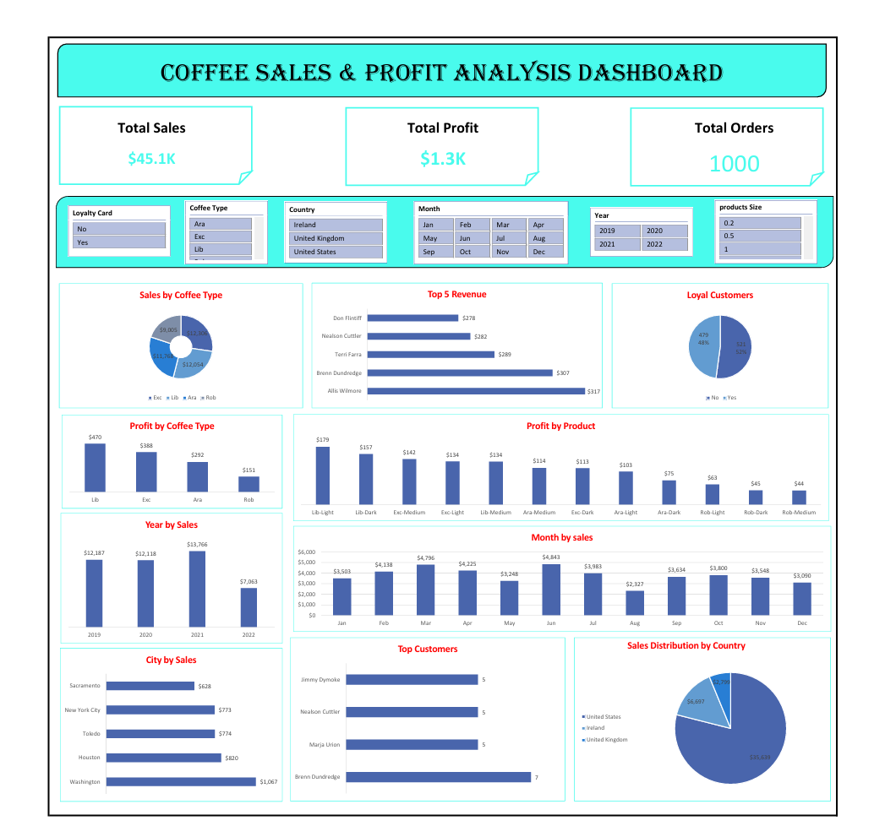

☕ Coffee Sales & Profit Analysis Dashboard

📊 Project Overview

This project analyzes coffee sales data using Excel.

🔧 Tools Used

- Microsoft Excel
- Pivot Tables
- Charts
- Data Cleaning

📈 Key Insights

1) USA → Highest Sales
   👉 Focus business more in USA
2) Lib-L → Highest Profit
   👉 Promote this product more
3) Exc products → High sales, low profit
   👉 Check pricing / reduce cost
4) UK → Lowest sales
   👉 Need marketing improvement
5) Top customers → Few people give most sales
   👉 Give them loyalty offers
6) Popular coffee types (Exc / Ara)
   👉 Focus on high-demand types
7) Roast types uneven sales
   👉 Promote weak ones or remove
8) Sales vary by month
   👉 Plan offers based on season

🚀 Features

- Interactive dashboard
- KPI metrics (Sales, Profit, Orders)
- Product and customer insights

📊 Dashboard Preview

